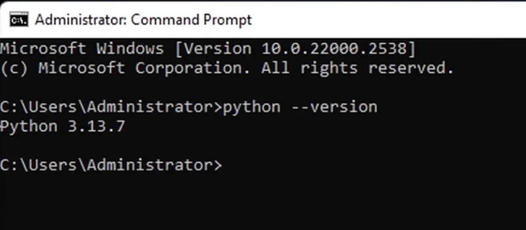
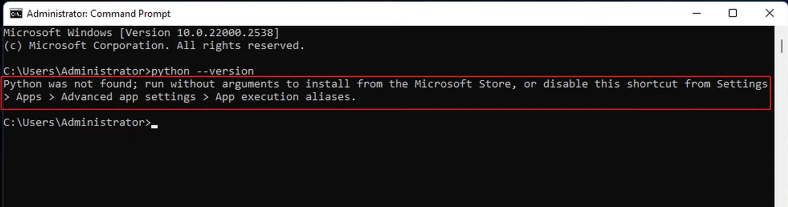
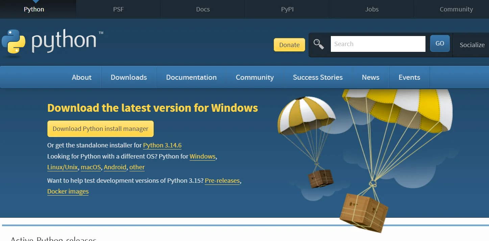
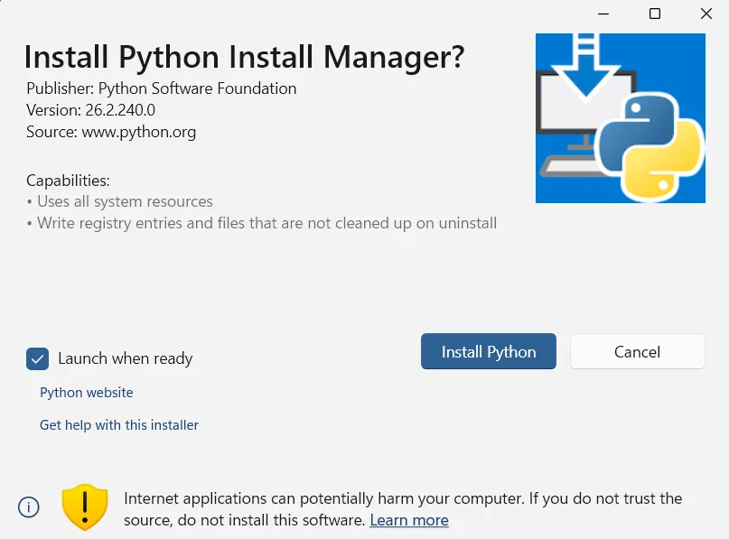
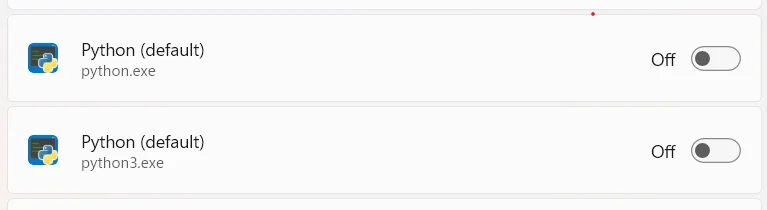

# How to Install Python on Windows 10/11 - A Complete Beginner's Guide

Never installed Python before? No problem. This guide covers everything step by step. Note that these instructions are written for Python 3.14.6. If you're installing a newer version, most steps will be the same but some details may look a little different.

## Table of Contents

- [What Is Python and Why Do I Need It?](#what-is-python-and-why-do-i-need-it)
- [Before You Start](#before-you-start)
- [Installing Python](#installing-python)
- [Understanding the Terminal](#understanding-the-terminal)
- [Next Steps](#next-steps)
- [Common Problems & Fixes](#common-problems--fixes)
- [References Used](#references-used)

---

## What Is Python and Why Do I Need It?

Python is a free programming language that many tools and apps are built on. You don't need to learn how to code - you just need Python installed on your computer so those tools can run.

Think of it like installing Java or a printer driver: you're not going to use it directly, but other software needs it to work.

---

## Before You Start

Check if Python is already installed on your computer.

1. Open a Terminal. On Windows, press `Windows key + R`, type `cmd`, press Enter to open the Terminal.

2. Type the following and press Enter:
   ```
   python --version
   ```

3. If you see something like `Python 3.11.4`, Python is already installed and you're done! 


   But if you see an error or `Python 2.x.x` (an older version), you'll need to install Python 3. Follow the steps below.
   

---

## Installing Python

### Step 1 -  Download the Installer

1. Open your web browser and go to: [https://www.python.org/downloads/](https://www.python.org/downloads/)



2. You'll see a big yellow button that says **"Download Python install manager"** - click it
3. A file called something like `python-manager-26.2.msix` will download to your computer

### Step 2 - Run the Installer

1. Find the downloaded file (usually in your Downloads folder) and double-click it
2. A setup window will appear


3. Click **"Install Now"**
4. If Windows asks "Do you want to allow this app to make changes?", click **Yes**
5. Wait for the installation to finish - it usually takes 1 - 2 minutes
6. Click **Close** when done

### Step 3 - Verify the Installation

1. Open a new Terminal window (close the old one first if it was open, then press `Windows key + R`, type `cmd`, press Enter)
2. Type:
   ```
   python --version
   ```
3. You should see something like `Python 3.14.6`. If you do, Python is installed successfully!

---

## Understanding the Terminal

You'll use the terminal to run Python tools. It looks intimidating but you only need to know a few basics:

- **You type commands and press Enter to run them** - nothing happens until you press Enter
- **Nothing will break** if you type something wrong - you'll just get an error message
- Just for fun, try typing `echo "Hello, World!"` and press Enter to see it printed back to you
- To go to a specific folder, use `cd path\to\folder` (use backslashes on Windows)
- To clear the screen, type `cls` and press Enter
- To close the terminal, type `exit` and press Enter, or just close the window

---

## What's Next?

Now that Python is installed, you can go back to the tool's installation guide and continue from where it told you to install Python.

If you ever need to check that Python is still working, just open a Terminal and run `python --version`.


---

## Common Problems & Fixes

### 1. "Python is not recognized as an internal or external command" (Windows)

This means Python wasn't added to PATH during installation. Fix it by:

1. Press Win + I to open Settings.
2. Navigate to Apps > Advanced app settings > App execution aliases (or search for "Manage App Execution Aliases").
3. Turn Off the toggles for python.exe and python3.exe.

4. Close and reopen your Terminal, then try running `python --version` again.

### 2. "I see Python 2.7 instead of Python 3"

Python 2 is outdated and won't work with modern tools. Install Python 3 from [python.org](https://www.python.org/downloads/) - having both versions on your computer is fine.

---

## References Used

1. [YouTube - How to Install Python on Windows 10/11 (Step by Step Guide) by @devityworks](https://youtu.be/3E3NZRpXZyI?si=iR_7ocWQ7g6FPEWv)

2. [python.org - Getting Started](https://www.python.org/about/gettingstarted/)