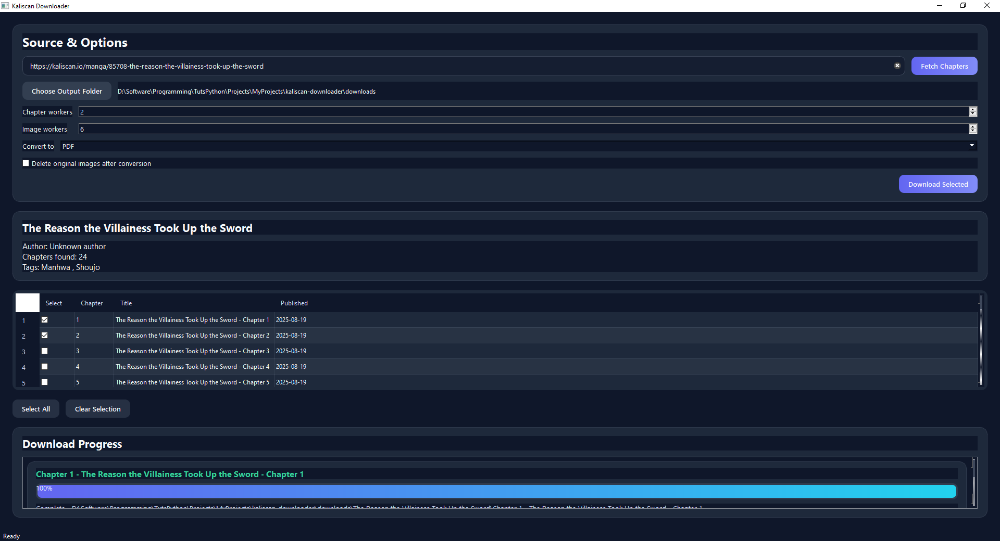

# Kaliscan Manga Downloader - Beginner's Guide for Windows

A friendly, step-by-step guide for downloading manga from Kaliscan - no coding experience needed.

## Table of Contents

- [What Is This Tool?](#what-is-this-tool)
- [Installation](#installation)
- [Using the GUI (Recommended for Beginners)](#using-the-gui-recommended-for-beginners)
- [Using the CLI (Advanced Users)](#using-the-cli-advanced-users)
- [Tips & Troubleshooting](#tips--troubleshooting)
- [Need More Help?](#need-more-help)

---

## What Is This Tool?

Kaliscan Downloader lets you save manga chapters from the Kaliscan website directly to your computer. You can download single chapters, a range of chapters, or an entire series, and optionally convert them to PDF or CBZ (a comic book format) for easy reading.

It has two modes:
- **GUI (Graphical Interface)** - A point-and-click window, easiest for beginners ✅
- **CLI (Command Line)** - A text-based terminal interface, for more advanced users

This guide focuses on the GUI, with CLI instructions at the end.

---
 ## Installation

### Before You Start - What You'll Need

You need to install two things: **Python** (the programming language this tool runs on) and the **tool itself**.

### Step 1 - Install Python

1. See the [Python installation guide](../installing-python/README.md) for detailed instructions.

---

### Step 2 - Download the Tool

1. Go to [https://github.com/Yui007/kaliscan-downloader](https://github.com/Yui007/kaliscan-downloader)
2. Click the green **"Code"** button near the top right
3. Click **"Download ZIP"**
4. Unzip the downloaded file somewhere easy to find, like your Desktop or Documents folder

---

### Step 3 - Open a Terminal in the Tool's Folder

You need to open a Terminal *inside* the folder you just unzipped.

1. Open the unzipped folder in File Explorer
2. Click on the address bar at the top (where it shows the folder path). It will select the entire path.
3. Type `cmd` and press Enter - a Terminal will open already pointed at that folder path. It will look something like this:
   ```
   C:\where\you\extracted\kaliscan-downloader>
   ```

---

### Step 4 - Install the Required Dependencies

In this step, you will set up a virtual environment and install the required dependencies in that environment. A virtual environment isolates the tool's dependencies from your main system. That way, the tool's requirements won't interfere with other programs on your computer. Think of it as having a private, separated room for each of your toys or projects, instead of throwing everything into one giant, messy closet. 


1. In the Terminal, type the following command to set up the virtual environment:
   ```
    python -m venv .venv
   ```

2. After running this command, activate the virtual environment by typing:
   ```
    .venv\Scripts\activate
   ```

   You should see `(venv)` at the beginning of your terminal prompt, like this. This confirms that the virtual environment is active:
   ```
   (venv) C:\where\you\extracted\kaliscan-downloader>
   ```

3. Then install the required dependencies by typing:
   ```
   pip install -r requirements.txt
   ```

4. Then install playwright for the required chromium browsers (e.g. Google Chrome, Microsoft Edge, etc.) by typing:
   ```
   playwright install chromium
   ```

   Wait for each command to finish before running the next. This may take a few minutes - that's normal. Once everything is installed, you're ready to use the tool.

5. Type the following command to verify that the tool is installed correctly:
   ```
   python main.py
   ```

   If the tool is installed correctly, a window will appear - that's the tool!
   

   To close the tool, simply click the **X** button in the top-right corner of the window. Alternatively, you can press `Ctrl + C` in the Terminal to stop the tool.

---

## Using the GUI (Recommended for Beginners)

### Launching the App

1. Open a Terminal in the tool's folder (Follow the instructions in [Step 3](#step-3---open-a-terminal-in-the-tools-folder)) and activate the virtual environment (if not already active). 
   ```
   .venv\Scripts\activate
   ```

   You should see `(venv)` at the beginning of your terminal prompt, like this. This confirms that the virtual environment is active:
   ```
   (venv) C:\where\you\extracted\kaliscan-downloader>
   ```

2. In the Terminal, type:
   ```
   python main.py
   ```
   A window will appear - that's the tool!

> **Note: In case if you got tired of typing the same commands over and over again, you can create a BAT file to open the GUI tool. See this [guide](./createBATFile.md) for more details. Before creating the BAT file, make sure you have successfully opened the GUI tool at least once following the instructions above.**

---

### Step-by-Step: Downloading Manga

**1. Get the manga URL**

Go to [kaliscan.io](https://kaliscan.io) in your browser find the manga you want, and copy the URL from the address bar. It will look something like:
```
https://kaliscan.io/manga/your-manga-title
```

**2. Paste the URL and fetch chapters**

Paste the URL into the input field at the top of the tool (labeled "Source & Options"), then click **Fetch Chapters**. The tool will load the chapter list - this may take a moment.

**3. Select which chapters to download**

You'll see a table of chapters, each with a checkbox. Tick the ones you want. Use **Select All** to grab everything, or **Clear Selection** to start over.

**4. Choose where to save your files**

Click **"Choose Output Folder"** and pick a folder on your computer where the manga will be saved.

**5. Pick a file format (optional)**

In the "Conversion" dropdown, you can choose:
- **None** - saves raw images (one folder per chapter)
- **PDF** - converts each chapter to a PDF file
- **CBZ** - converts each chapter to a comic book file (works with apps like YACReader or CDisplayEx)

You can also check a box to automatically delete the original images after conversion, to save disk space.

**6. Download!**

Click **Download Selected** and watch the progress bar. Each chapter will be downloaded in parallel for speed. If you see multiple windows opening, that's normal - each window is downloading a different chapter.

---

## Using the CLI (Advanced Users)

If you prefer the Terminal, all commands use `python main.py --cli`.

**See manga info:**
```
python main.py --cli scrape "https://kaliscan.io/manga/your-manga-title"
```

**Download all chapters:**
```
python main.py --cli download --url "https://kaliscan.io/manga/your-manga-title" --all
```

**Download a single chapter (e.g. chapter 5):**
```
python main.py --cli download --url "URL" --chapter 5
```

**Download a range (e.g. chapters 10 to 15):**
```
python main.py --cli download --url "URL" --range 10-15
```

**Interactive guided mode (recommended for CLI beginners):**
```
python main.py --cli interactive
```

### Useful CLI options

| Option | What it does | Default |
|---|---|---|
| `--output` or `-o` | Where to save files | `downloads/` |
| `--chapter-workers` | How many chapters download at once | 2 |
| `--image-workers` | How many images download at once per chapter | 6 |
| `--retries` | How many times to retry a failed download | 3 |

---

## Tips & Troubleshooting

**1. The chapter list won't load**

Make sure you're using the full manga URL (the one that ends in the manga's title slug), not a chapter URL.

**2. Where are my files saved?**

By default, a `downloads/` folder is created inside the tool's folder. You can change this in the GUI by clicking "Choose Output Folder".

**3. What's a CBZ file?**

CBZ is a standard comic book format. To read CBZ files, download a free app like [CDisplayEx](https://www.cdisplayex.com/) (Windows) or [YACReader](https://www.yacreader.com/) (Mac/Windows/Linux).

**4. The downloaded chapter folder is empty**

This usually means the chapter failed to download. Rika is still figuring out why this happens sometimes. Here are a few things you can try:
- **Workaround #1:** Delete the manifest file (if it exists) in the `downloads/` folder and try again. Manifest file keeps track of which chapters have been downloaded; and deleting it can help reset the download state and force the tool to re-download the chapter.
- **Workaround #2:** Close the tool first. Delete the manifest file in the `downloads/` folder (see **Workaround #1** above for more details). Then, deactivate and reactivate the virtual environment, and run the tool again using the following command in the terminal:
  ```
  deactivate && .venv\Scripts\activate && python main.py
  ```
  > Note: Rika haven't tried this workaround yet as Rika is unable to reproduce the issue consistently when **Workaround #1** doesn't work.

**5. The tool successfully downloaded the images but failed to convert them to PDF**

Retry downloading the chapter (or click on "Download Selected Chapters" button on the GUI). Typically the tool will pick up where it left off and convert the already downloaded images to PDF.

Before retrying, be sure to select the chapters that failed to convert so the tool can start from where it left off.

**6. I got the error message: "Failed to convert images to PDF: Page size must be between 3 and 14,400 PDF units"**

This error occurs when downloading webtoon (vertical scrolling) format manga. The images are too tall or too short to fit within the PDF page size limits. Ideally the image width or height should be between 4 and 19,200 pixels. 

Here's a workaround:

  1. First, find the affected pdf(s) in the `downloads/` folder which are usually 0KB in size or corrupted when opened. 
  2. Then, identify the affected chapter folder(s) and go into them. 
  3. Look for image files with height / width that is either smaller than 4 pixels or larger than 19,200 pixels, and then manually delete them. Alternatively, you can resize or split them using an image editor so that their dimensions fall within the acceptable range. 
  4. After that, try downloading the chapter again. If the images are already downloaded, the tool will convert them to PDF.

**7. Downloads are slow**

Try increasing the `--image-workers` value in CLI mode, or adjust the "Image Workers" slider in the GUI.

Personally, Rika wouldn't recommend setting it too high if your computer doesn't have a lot of RAM, especially when the computer get heated up and the fans start to spin loudly.

---

## Need More Help?

Visit the project page on GitHub: [https://github.com/Yui007/kaliscan-downloader](https://github.com/Yui007/kaliscan-downloader)

You can open an "Issue" there if something isn't working.